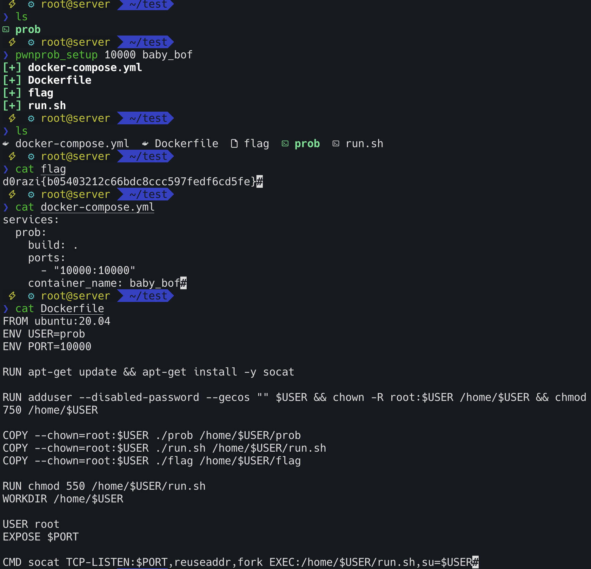

# pwnprob_setup v.0.1.0
- Create a pwnprob base file tool


# Feature
1. Set docker-compose.yml file
2. Set Dockerfile
3. Set flag file

# Usage
`pwnprob_setup <port> <docker-container-name>`

## Using pwnprob_setup
Run
```bash
pwnprob_setup 10010 babybof
```
